<div align="center">

<!-- PORTRAIT - generated by scripts/dotify.py from assets/jacket.png.
     Colour mode, so one file serves both GitHub themes. Regenerate with:
       python scripts/dotify.py assets/jacket.png -o assets/portrait \
         --cols 100 --equalize --detail 0.5 --color -->


<br>

<!-- NAME - animated typing -->
<a href="https://github.com/adyonchain">
  
</a>

<br>

<!-- SOCIALS -->
<a href="https://www.linkedin.com/in/adrianaledezmam"></a>
<a href="mailto:adyledd@gmail.com"></a>
<a href="https://www.instagram.com/adyonchain"></a>
<a href="https://x.com/adyonchain"></a>


</div>

---

## Hello! I'm Ady 👋

```console
From Financial Engineer to Data Scientist, tech-obsessed since way before it was my job title. Building from Bolivia!
``` 

- 🎓 I just defended my MBA thesis at the **Universidade de São Paulo** in Brazil: an AI model that prices on-chain datasets. Turns out data is worth wildly different amounts depending on who's asking 👀.

- 📊 What I actually do: take data that looks intimidating and hand it back in a form people can use.

- 🏦 Before all this, I worked in **corporate banking**: financial statements, credit reports and client databases.

- ⚡ Currently cooking: **tech and data, but girly** in plain Spanish, for everyone who was told this world wasn't built for them.

- 🚀 Where I'm headed: **data and AI in finance**.

- ⚙️ Español · English · Português

✨ **Fun fact:** I learned to code because I got tired of describing the app I wanted to someone else.

<br>

<div align="center">

## My OGs 💻


</div>

---

<div align="center">

## Tech Radar 📡

<tr>
<td width="50%" align="center" valign="middle">

<!-- Self-rated radar - edit assets/skills.json, the workflow redraws it -->
<picture>
  <source media="(prefers-color-scheme: dark)"  srcset="assets/radar-dark.svg">
  <source media="(prefers-color-scheme: light)" srcset="assets/radar-light.svg">
  
</picture>

</td>
<td width="50%" align="center" valign="middle">

<!-- Live radar built from real language byte counts across your repos -->
<picture>
  <source media="(prefers-color-scheme: dark)"  srcset="assets/radar-langs-dark.svg">
  <source media="(prefers-color-scheme: light)" srcset="assets/radar-langs-light.svg">
  
</picture>

</td>
</tr>
</table>

</div>

---

<div align="center">

## Contribution Calendar 💡

<!-- 3D isometric calendar, regenerated every 6h by .github/workflows/metrics.yml -->


<br><br>

<!-- Snake eats the contribution graph - .github/workflows/snake.yml -->
<picture>
  <source media="(prefers-color-scheme: dark)"  srcset="https://raw.githubusercontent.com/gargibhardwaj24/gargibhardwaj24/output/snake-dark.svg">
  <source media="(prefers-color-scheme: light)" srcset="https://raw.githubusercontent.com/gargibhardwaj24/gargibhardwaj24/output/snake.svg">
  
</picture>

</div>

---

<div align="center">

<sub> ⋆˚࿔ Built with curiosity, data & code ⋆˚࿔ </sub>

</div>
